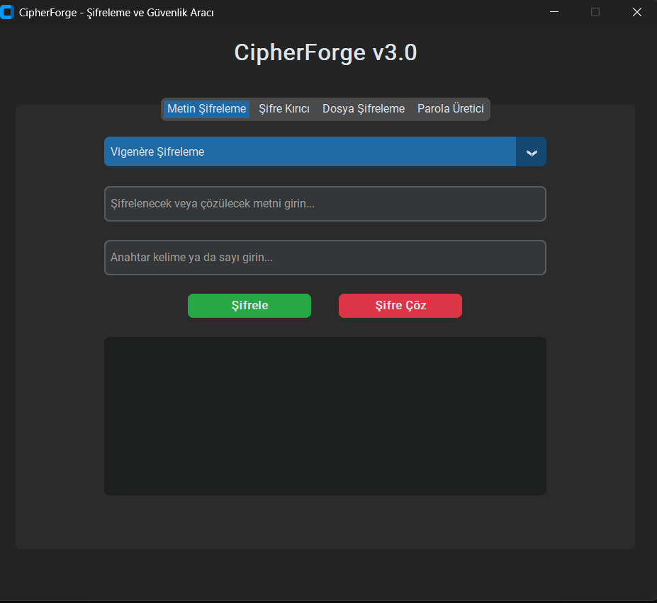
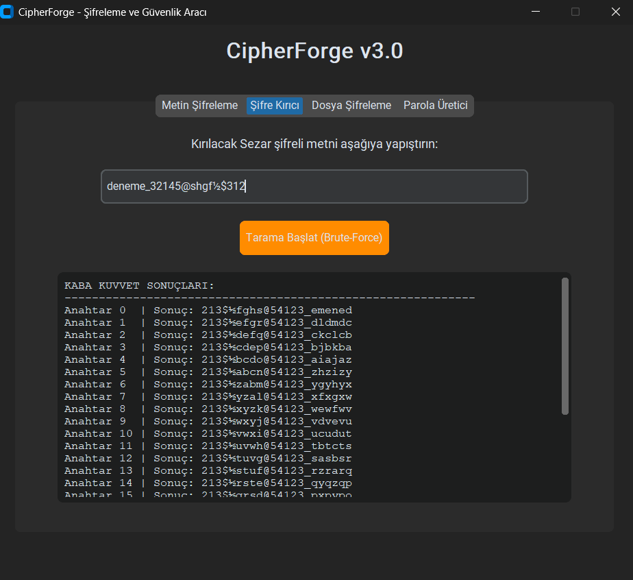
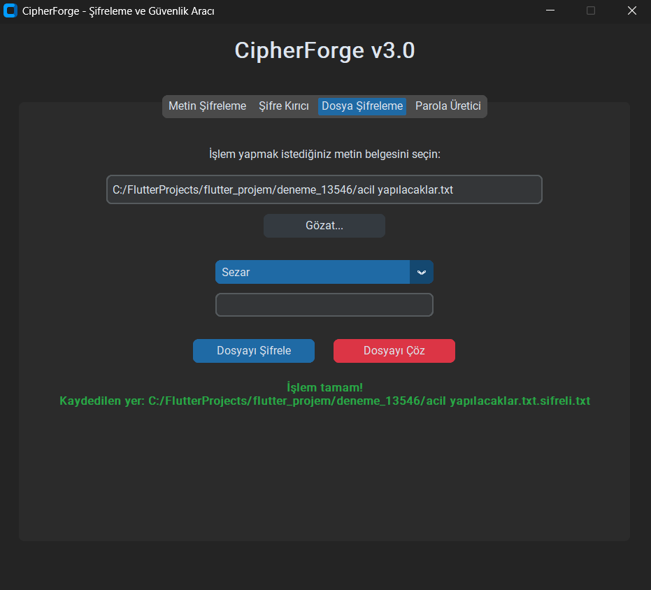
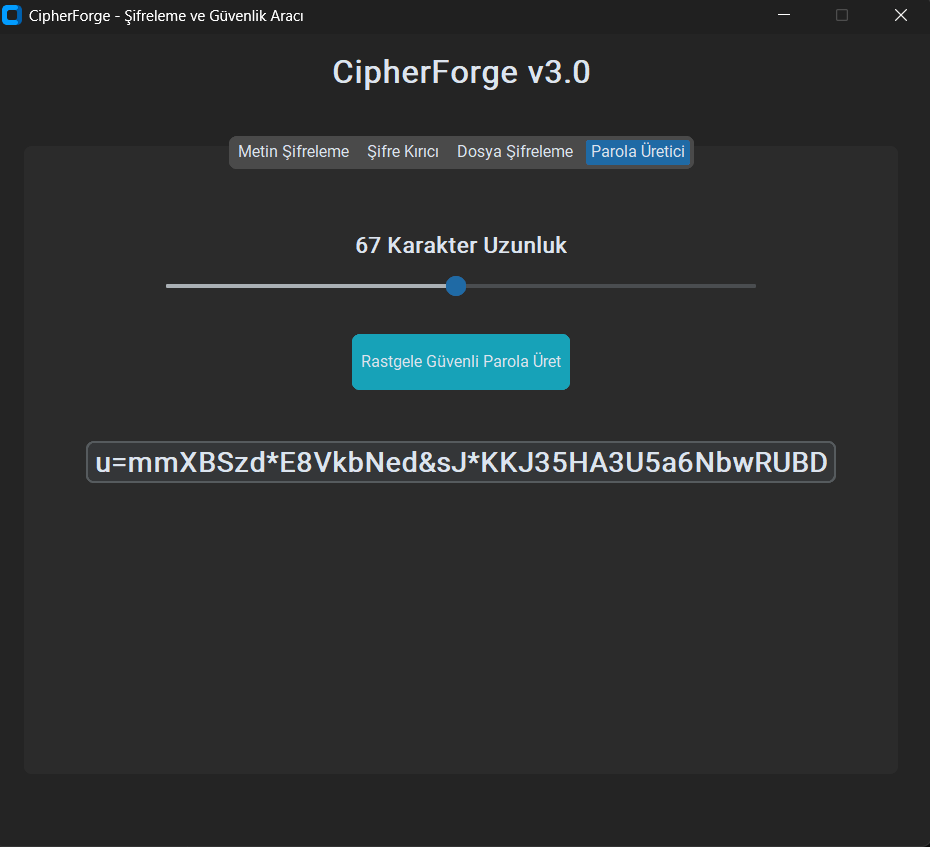
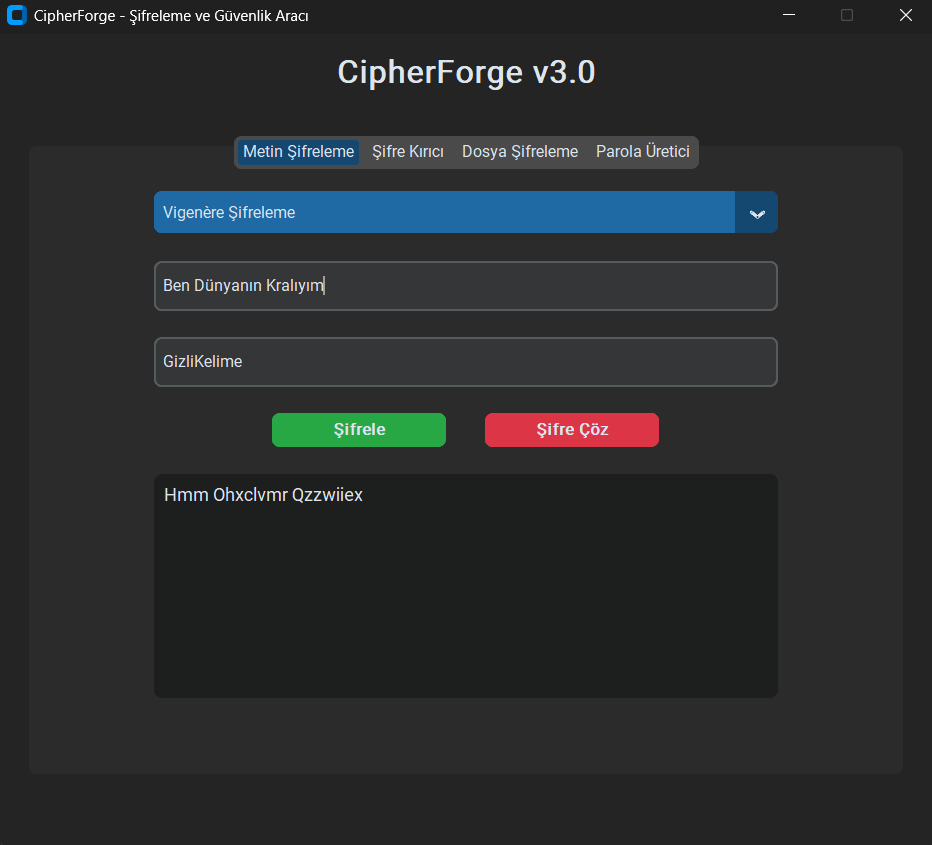
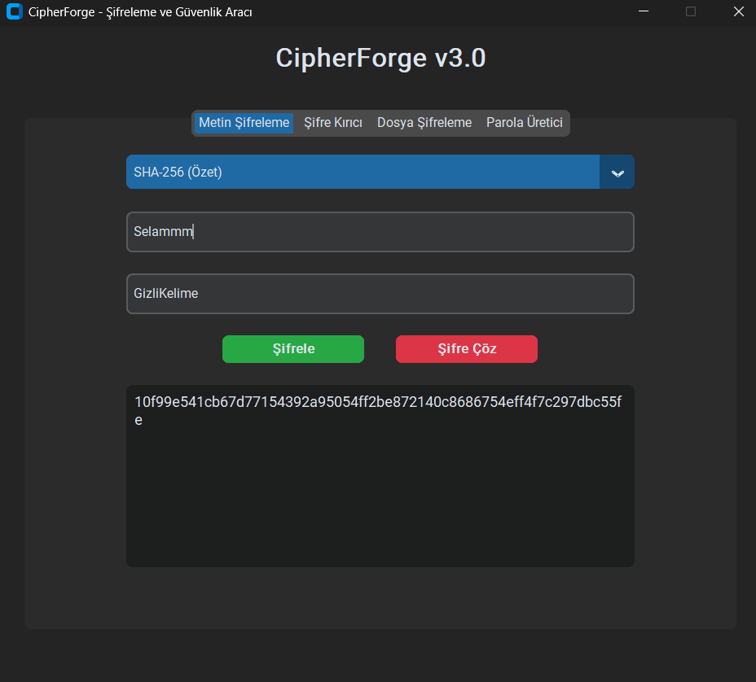

# 🔐 CipherForge v3.0

[](https://opensource.org/licenses/MIT)
[](https://www.python.org/)
[](https://github.com/TomSchimansky/CustomTkinter)

> Şifreleme ve güvenlik aracı, Python ile yazılmış, profesyonel bir masaüstü uygulaması. Sezar şifresi, Vigenère şifrelemesi, SHA-256 hashing ve güvenli parola üretimi gibi birçok özellik içerir.

---

## 📋 İçindekiler

- [Özellikler](#-özellikler)
- [Ekran Görüntüleri](#-ekran-görüntüleri)
- [Kurulum](#-kurulum)
- [Kullanım](#-kullanım)
- [Şifreleme Algoritmaları](#-şifreleme-algoritmaları)
- [Proje Yapısı](#-proje-yapısı)
- [Geliştirici Notları](#-geliştirici-notları)

---

## ✨ Özellikler

### 🎨 Modern Arayüz
- **CustomTkinter** kullanarak modern, koyu tema tasarımı
- Sekme tabanlı düzenli kullanıcı arayüzü
- Basit ve sezgisel kontroller

### 🔐 Şifreleme Araçları
| Özellik | Açıklama |
|---------|----------|
| **Sezar Şifrelemesi** | Klasik sezar şifrelemesi + ters çevir birleşimi |
| **Vigenère Şifrelemesi** | Kelime anahtarı kullanarak güçlü şifreleme |
| **SHA-256 Hashing** | Tek yönlü güvenli parola özeti oluşturma |
| **Şifre Kırıcı (Brute-Force)** | Sezar şifreli metinleri kaba kuvvetçü yöntemle çöz |
| **Dosya Şifreleme** | Bilgisayardaki metin dosyalarını şifrele/çöz |
| **Parola Üretici** | Güvenli ve karmaşık parolalar otomatik oluştur |

---

## 📸 Ekran Görüntüleri

### Temel Operasyonlar
| Ana Ekran & Şifreleme | Şifre Kırıcı (Brute-Force) |
| :---: | :---: |
|  |  |

### Dosya İşlemleri & Parola Üretici
| Dosya Şifreleme | Parola Üretici |
| :---: | :---: |
|  |  |

### Gelişmiş Şifreleme Algoritmaları
| Vigenère Şifrelemesi | SHA-256 Özetleme |
| :---: | :---: |
|  |  |

---

## 🛠️ Kurulum

### Gereksinimler
- Python 3.8 veya üzeri
- pip (Python paket yöneticisi)

### Adım Adım Yükleme

1. **Projeyi klonlayın veya indirin:**
   ```bash
   git clone https://github.com/KralAthena/CipherForge.git
   cd CipherForge
   ```

2. **Gerekli kütüphaneyi yükleyin:**
   ```bash
   pip install customtkinter
   ```

3. **Uygulamayı çalıştırın (v3 - GUI):**
   ```bash
   python cipherforge_v3.py
   ```

4. **_Opsiyonel:_ Eski konsol versiyonunu çalıştırın:**
   ```bash
   python main.py
   ```

---

## 💻 Kullanım

### 1️⃣ Metin Şifreleme
- **İslem:** Seç (Sezar / Vigenère / SHA-256)
- **Metin:** Şifrelenecek metni gir
- **Anahtar:** Algoritması gerektiriyorsa anahtar yap
- **Sonuç:** Şifrele/Çöz butonlarına bas

### 2️⃣ Şifre Kırıcı (Brute-Force)
- Sezar şifreli metni yapıştır
- "Tarama Başlat" butonuna tıkla
- Tüm 26 kombinasyon otomatik denenir
- Sonuçları incele ve doğru şifreyi bul

### 3️⃣ Dosya Şifreleme
- "Gözat..." ile metin dosyası seç
- Algoritma ve anahtar belirle
- "Şifrele" veya "Çöz" tıkla
- Yeni dosya otomatik oluşturulur

### 4️⃣ Parola Üretici
- Güvenli parola uzunluğu seç
- "Oluştur" tıkla
- Kopia yap ve kullan

---

## 🔧 Şifreleme Algoritmaları

### 🔤 Sezar & Ters Çevir
- **Yöntem:** Metni ters çevir + her harfi anahtarla kaydır
- **Kullanım:** Basit, aşama aşama uygulanabilir
- **Anahtar:** Sayı (0-25 arası)
- **Güvenlik:** Düşük (eğitim amaçlı)

### 🔐 Vigenère Şifrelemesi
- **Yöntem:** Kelime anahtarı kullanarak polialfabetik şifreleme
- **Kullanım:** Daha güvenli metin şifreleme
- **Anahtar:** Kelime/cümle
- **Güvenlik:** Orta (frekans analizi ile kırılabilir)

### 🛡️ SHA-256 Hashing
- **Yöntem:** Metni 256-bit hexadecimal değere dönüştür
- **Kullanım:** Parola depolama, veri bütünlüğü
- **Anahtar:** Gerekli değil
- **Güvenlik:** Yüksek (tek yönlü, geri dönüştürülemez)

---

## 🧩 Proje Yapısı

```
CipherForge/
├── cipherforge_v3.py      # Ana GUI uygulaması (CustomTkinter)
├── main.py                 # Eski konsol versiyonu
├── README.md               # Bu dosya
├── assets/                 # Ekran görüntüleri
│   ├── cipherforge_main.png
│   ├── cipherforge_brute.png
│   ├── cipherforge_dosya.png
│   ├── cipherforge_parola.png
│   ├── cipherforge_vigenere.png
│   └── cipherforge_sha256.png
```

---

## 🏗️ Geliştirici Notları

### Mimari Tasarım
CipherForge, **Nesne Yönelimli Programlama (OOP)** prensiplerine sadık kalarak tasarlanmıştır:

```
🔹 Şifreleme Sınıfları          🔹 GUI Sınıfı
  ├─ TersCevirici                ├─ CipherForgeApp
  ├─ SezarSifresi                │   ├─ islem_sekmesini_kur()
  └─ VigenereSifresi             │   ├─ kiri_sekmesini_kur()
                                 │   ├─ dosya_sekmesini_kur()
                                 │   └─ parola_sekmesini_kur()
```

### Sınıf Sorumlulukları
| Sınıf | Görev |
|-------|-------|
| `TersCevirici` | Metni ters çevirme işlemi |
| `SezarSifresi` | Sezar algoritması (şifrele/çöz) |
| `VigenereSifresi` | Vigenère algoritması (şifrele/çöz) |
| `CipherForgeApp` | Arayüz tasarımı ve olay yönetimi |

- 🎯 **Ayrılmış Sorumda Prensibi:** Her sınıf kendine özgü işle ilgilenir
- 🔄 **Yeniden Kullanılabilirlik:** Şifreleme sınıfları GUI'den bağımsız
- 🛡️ **Bakımlanabilirlik:** Kod modüler ve anlaşılması kolay

### Kütüphaneler
- `customtkinter` - Modern GUI tasarısı
- `hashlib` - SHA-256 hashing
- `tkinter.filedialog` - Dosya seçim diyaloğu
- `os` - İşletim sistemi işlemleri

---

## 📝 Lisans

Bu proje **MIT Lisansı** altında yayınlanmıştır.  
Ayrıntılar için [LICENSE](LICENSE) dosyasını kontrol edin.

---

## 👤 Geliştirici

**KralAthena** tarafından geliştirilmiş ve bakımı yapılan bir proje.

### İletişim & Katkıda Bulunma
- 🐛 Hata buldum → GitHub Issues açınan
- ✨ Yeni fikir → Pull Request gönder
- 💡 Önerini var → Discussions başlat

---

## ⭐ Destek

Bu proje beğendiysen, yıldız (★) atarak destek verebilirsin! ⭐

---

<div align="center">

Made with ❤️ by KralAthena

</div>
